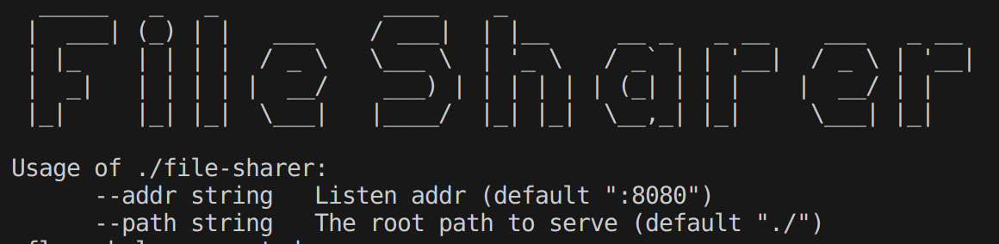

# File Sharer

A deadly simple cross-platform file sharer.

## Quickstart

## Features
- [x] Support Download file
- [x] Support upload file
- [x] Supoort log server info
- [x] Support safe mode, only listening on local machine or intranet
- [ ] Support download file by scan qr-code
- [ ] Support folder travel
- [ ] Support drag file to upload
- [ ] Support file delete and create folder?
- [ ] Integrate https://github.com/qifi-dev/qrs
